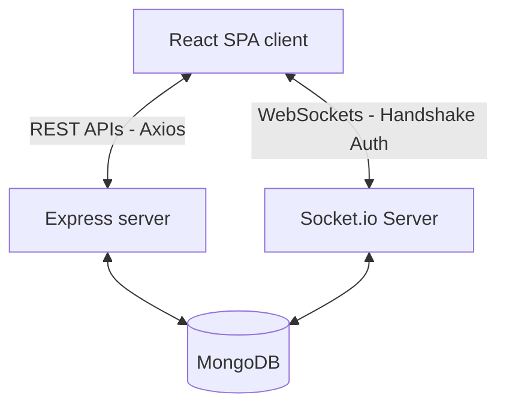

# TaskFlow - Real-Time Enterprise Task Management System

A production-grade, portfolio-ready Task Management Application built using the MERN stack (MongoDB, Express, React, Node.js) with Socket.io for live event synchronization, JWT-secured auth sessions, and role-based access control (RBAC).

---

## Technical Architecture & Design

The application enforces a separation of concerns using a modular **MVC (Model-View-Controller)** pattern on the backend and a reactive, Context-driven component architecture on the frontend.



### Key Architectural Systems:
1. **Stateless JWT Handshake**: Logins sign a JSON Web Token containing the user ID and role. The token is appended to standard `Authorization: Bearer <token>` headers.
2. **WebSocket Handshake Auth & Isolated Rooms**: Socket connections pass the JWT token in the authentication handshake. Upon verification, the connection is bound to:
   - A private user room: `user_<id>`
   - A corporate role room (if admin): `role_admin`
   This isolates event scopes, preventing global event leaks and data sniffing.
3. **Collapsible Shell Container Layout**: A layout wrapper coordinates sticky sidebar directories (which transition to bottom bars on mobile) and header navs containing user menu cards and live notification bells.
4. **Weighted Telemetry Cards**: The dashboard measures workload volume, applying visual highlights (rose borders, glowing alert indicators, and warning icons) to overdue tasks to convey urgency.
5. **Clean Analytics Charts**: Recharts widgets are styled to match the dark cobalt branding. Gridlines and legends are omitted to maintain clean layouts.

---

## Directory Structure

```
├── client/                     # React Frontend SPA (Vite)
│   ├── src/
│   │   ├── api/                # Axios configuration and global interceptors
│   │   ├── components/         # Global layout assets (Navbar, Sidebar, NotificationBell)
│   │   ├── context/            # global state layers (Auth, Socket, Toast)
│   │   ├── pages/              # View wrappers (Login, Dashboard, Tasks, Profile, Admins)
│   │   ├── routes/             # Guards (ProtectedRoute, AdminRoute) and router paths
│   │   ├── App.jsx             # Root layout context mounts
│   │   └── index.css           # Custom variables and tailwind overrides
├── server/                     # Express API Server (Node.js)
│   ├── config/                 # database configurations
│   ├── controllers/            # route handler controllers (MVC logic)
│   ├── middleware/             # protectors (protect auth, authorizeRoles checks)
│   ├── models/                 # Mongoose schemas (User, Task, Notification)
│   ├── routes/                 # routing paths
│   ├── sockets/                # Socket.io JWT handshake validation and rooms
│   └── utils/                  # administrative seeds (seedAdmin) and token signers
```

---

## Installation & Setup

### Prerequisites
- Node.js (v20 or higher)
- MongoDB Community Server (running locally on port `27017`) or a MongoDB Atlas connection string.

### Configuration
1. Clone the repository workspace.
2. Create `server/.env` matching variables inside `server/.env.example`:
```env
PORT=5001
NODE_ENV=development
MONGO_URI=mongodb://localhost:27017/task_management
JWT_SECRET=supersecuresecretkey
JWT_EXPIRE=30d
```

### Running the Services

#### 1. Setup the Database Administrator
Run the admin seeder script directly in the backend workspace to create the first admin access key before starting the servers:
```bash
cd server
npm install
node utils/seedAdmin.js
```
*Output:*
```
Database connected successfully.
Creating default administrator account...
Admin account seeded successfully!
Email:    admin@example.com
Password: admin123
```

#### 2. Start Backend API Server
Start Nodemon monitoring in development mode:
```bash
npm run dev
```
*Backend active on [http://localhost:5001](http://localhost:5001).*

#### 3. Start Frontend Client
In a new terminal window:
```bash
cd client
npm install
npm run dev
```
*Frontend active on [http://localhost:5173](http://localhost:5173).*

---

## API Documentation

All routes expect JSON payloads and return a structured shape:
`{ success: boolean, message: string, data?: any }`

### Authentication Endpoints

| Method | Endpoint | Access | Description |
| :--- | :--- | :--- | :--- |
| `POST` | `/api/auth/register` | Public | Register new user. Role is forced to `"user"`. |
| `POST` | `/api/auth/login` | Public | Login credentials, returns JWT token. |
| `GET` | `/api/auth/me` | Private | Retrieve active profile details. |
| `POST` | `/api/auth/logout` | Private | Clear cookies/session credentials. |

*Sample Login Payload (`POST /api/auth/login`):*
```json
{
  "email": "user@example.com",
  "password": "password123"
}
```

### Task Endpoints

| Method | Endpoint | Access | Description |
| :--- | :--- | :--- | :--- |
| `POST` | `/api/tasks` | Private | Create a task. |
| `GET` | `/api/tasks` | Private | List tasks. Non-admins only see owned/assigned items. |
| `GET` | `/api/tasks/:id` | Private | Retrieve task details. Owner/Assignee/Admin check enforced. |
| `PUT` | `/api/tasks/:id` | Private | Modify task. Restricted to creator or Admin. |
| `DELETE` | `/api/tasks/:id` | Private | Remove task. Restricted to creator or Admin. |
| `PATCH` | `/api/tasks/:id/status` | Private | Change task status. Permitted for Creator/Assignee/Admin. |
| `PATCH` | `/api/tasks/:id/assign` | Private | Modify assignee. Restricted to Creator or Admin. |

### Administration Endpoints

| Method | Endpoint | Access | Description |
| :--- | :--- | :--- | :--- |
| `GET` | `/api/users` | Admin Only | Get all registered accounts. |
| `GET` | `/api/users/:id` | Admin Only | Get individual account details. |
| `PUT` | `/api/users/:id` | Admin Only | Update account metadata or change access role. |
| `DELETE` | `/api/users/:id` | Admin Only | Remove user profile. Prevents self-deletion. |

---

## Known Boundaries & Design Decisions

### Role-Escalation Security Gap
To prevent unauthorized users from registering as administrators, the public register endpoint (`POST /api/auth/register`) strictly ignores the `role` parameter inside the request body, hardcoding user creation to the `"user"` role. Role promotions are restricted to:
1. Running the CLI database seeder `node server/utils/seedAdmin.js`.
2. Existing administrators modifying accounts via `PUT /api/users/:id`.

### Port Conflicts
Port `5000` is blocked by default on macOS due to AirPlay Receiver processes. The backend API server is configured to run on port `5001` (customizable via `.env`).

---

## Future Roadmap Improvements
- **Subtask Checklists**: Support tracking smaller subtasks inside task documents.
- **Dynamic Attachment Uploads**: Integrate AWS S3 or Cloudinary storage for task documentation assets.
- **Advanced Comment History**: Threaded comments with user tagging.
