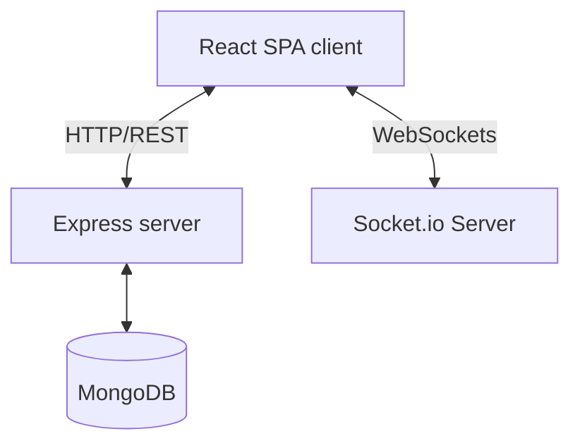

# MERN Task Management Application

A production-ready, portfolio-grade Task Management Application built using the MERN stack (MongoDB, Express, React, Node.js) with Socket.io for real-time synchronization and notifications.

## Features

- **Real-Time Collaboration**: Dynamic updates to tasks (creation, edits, comments, assignment changes) across concurrent sessions via Socket.io.
- **Role-Based Access Control (RBAC)**: Distinct permissions for `admin` and `user` roles to control task delegation and administrative actions.
- **Robust JWT Authentication**: JSON Web Token authentication with secure cookies/headers and bcrypt hashing.
- **Interactive Dashboard**: Modern visualizations (via Recharts) mapping metrics (Total, Completed, In-Progress, Overdue tasks) alongside priority breakdowns.
- **Clean Architecture**: Node backend structured as Model-View-Controller (MVC) and React frontend structured with components, hooks, contexts, and pages.

---

## Tech Stack

- **Frontend**: React (Vite), Tailwind CSS, Recharts, Lucide React, Axios, Socket.io-client
- **Backend**: Node.js, Express.js, MongoDB, Mongoose, Socket.io
- **Testing**: Postman, Local Unit / Endpoint Verification

---

## Setup & Installation

### Prerequisites
- Node.js (v20+)
- MongoDB (Local instance or Atlas URI)

### Local Configuration

1. Clone this repository.
2. Configure environment variables in `server/.env` (see `server/.env.example`).
3. Set up frontend configurations in `client/src/api/axios.js`.

### Running the Servers

#### Server:
```bash
cd server
npm install
npm run dev
```

#### Client:
```bash
cd client
npm install
npm run dev
```

---

## Architecture Diagram


